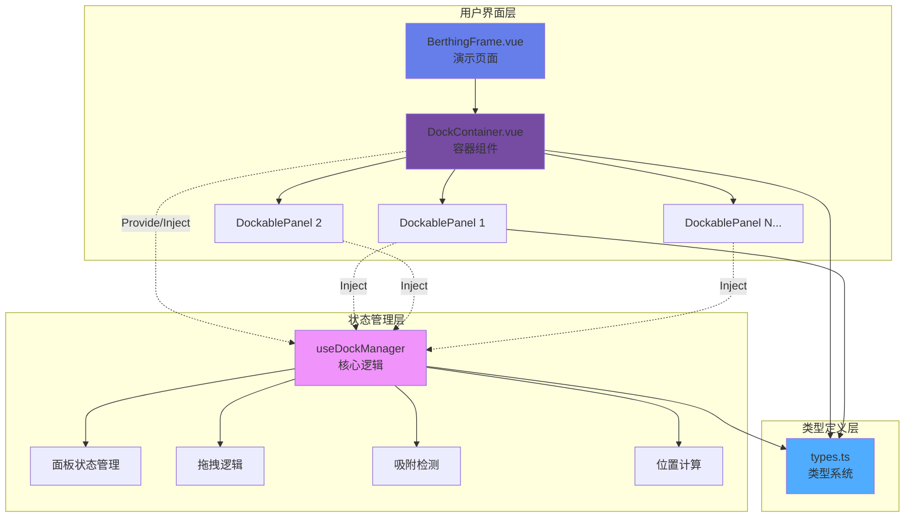
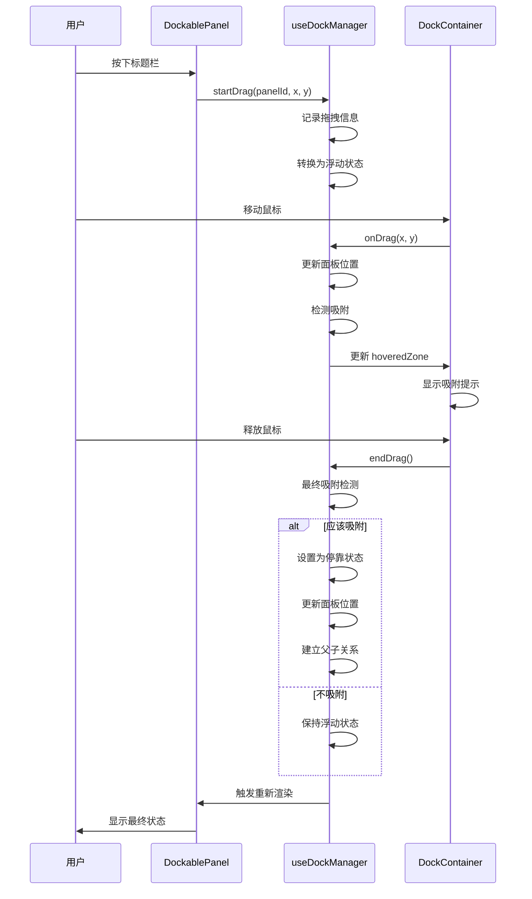
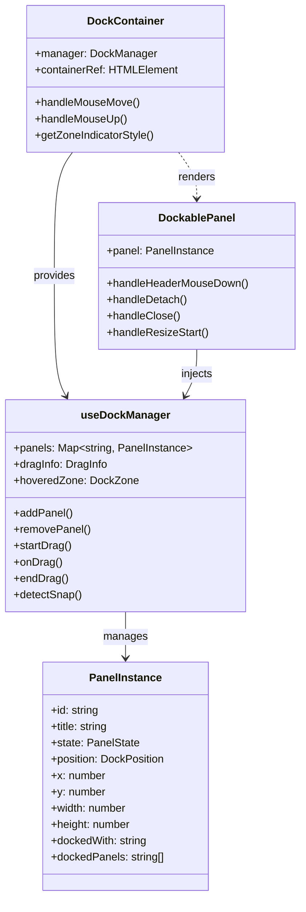
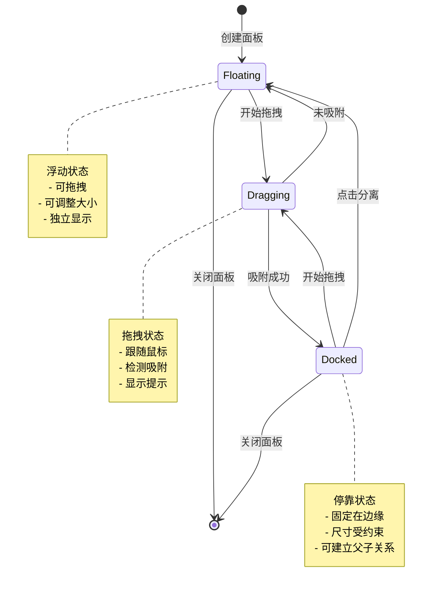
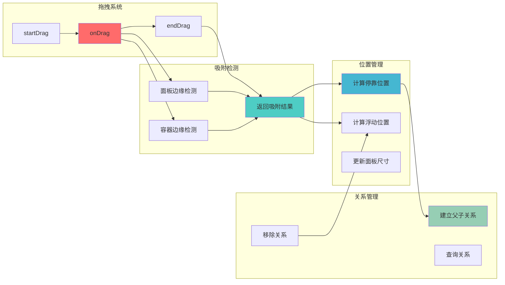
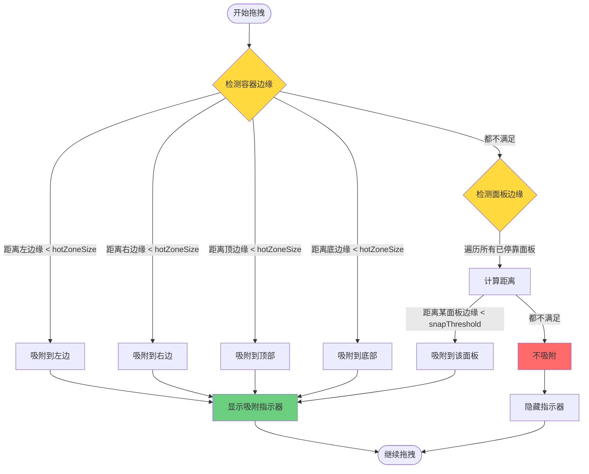
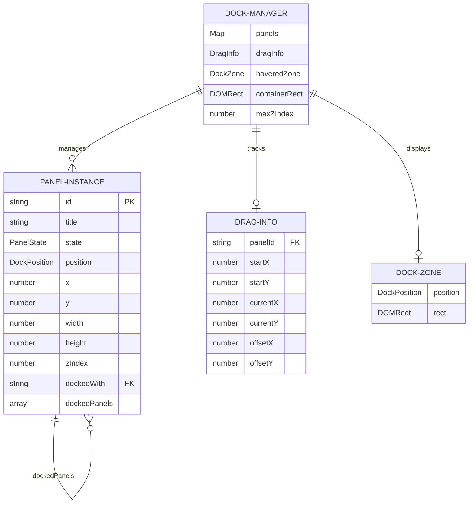
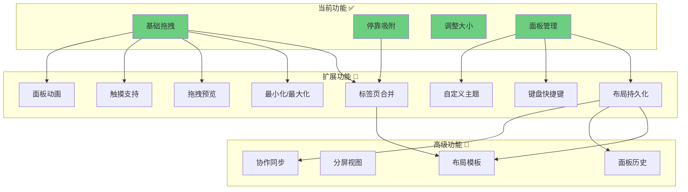

# 停泊吸附系统 - 架构设计图

## 📊 系统架构概览



## 🔄 数据流图



## 🏗️ 组件关系图



## 🎯 状态转换图



## 🧩 核心功能模块



## 📐 吸附检测算法流程



## 🎨 UI 层级结构

```
┌─────────────────────────────────────────────────────────┐
│ DockContainer (z-index: 1)                              │
│ ┌─────────────────────────────────────────────────────┐ │
│ │ Main Content Area                                    │ │
│ │ (用户自定义内容)                                      │ │
│ └─────────────────────────────────────────────────────┘ │
│                                                           │
│ ┌───────────────────┐  ┌───────────────────┐            │
│ │ Panel 1           │  │ Panel 2           │            │
│ │ (z-index: 1001)   │  │ (z-index: 1002)   │            │
│ │ ┌───────────────┐ │  │ ┌───────────────┐ │            │
│ │ │ Header        │ │  │ │ Header        │ │            │
│ │ ├───────────────┤ │  │ ├───────────────┤ │            │
│ │ │               │ │  │ │               │ │            │
│ │ │ Content       │ │  │ │ Content       │ │            │
│ │ │               │ │  │ │               │ │            │
│ │ └───────────────┘ │  │ └───────────────┘ │            │
│ └───────────────────┘  └───────────────────┘            │
│                                                           │
│ ┌─────────────────────────────────────────────────────┐ │
│ │ Dock Zone Indicator (z-index: 9999)                  │ │
│ │ (仅拖拽时显示)                                        │ │
│ └─────────────────────────────────────────────────────┘ │
└─────────────────────────────────────────────────────────┘
```

## 📊 数据结构关系



## 🔧 核心算法伪代码

### 吸附检测算法

```
function detectSnap(panel, mouseX, mouseY):
    // 1. 检测容器边缘
    if mouseX - container.left < hotZoneSize:
        return { shouldSnap: true, position: 'left' }
    if container.right - mouseX < hotZoneSize:
        return { shouldSnap: true, position: 'right' }
    if mouseY - container.top < hotZoneSize:
        return { shouldSnap: true, position: 'top' }
    if container.bottom - mouseY < hotZoneSize:
        return { shouldSnap: true, position: 'bottom' }
    
    // 2. 检测面板边缘
    for each dockedPanel in panels:
        if abs(mouseX - dockedPanel.left) < snapThreshold:
            return { shouldSnap: true, position: 'left', targetPanelId }
        if abs(mouseX - dockedPanel.right) < snapThreshold:
            return { shouldSnap: true, position: 'right', targetPanelId }
        // ... 检测上下边缘
    
    return { shouldSnap: false }
```

### 拖拽流程

```
function startDrag(panelId, x, y):
    panel = getPanel(panelId)
    panel.zIndex = ++maxZIndex
    
    if panel.state == 'docked':
        panel.state = 'floating'
        removeFromParent(panel)
    
    panel.state = 'dragging'
    
    dragInfo = {
        panelId: panelId,
        startX: x,
        startY: y,
        offsetX: x - panel.x,
        offsetY: y - panel.y
    }

function onDrag(x, y):
    if not dragInfo:
        return
    
    panel = getPanel(dragInfo.panelId)
    panel.x = x - dragInfo.offsetX
    panel.y = y - dragInfo.offsetY
    
    snapResult = detectSnap(panel, x, y)
    if snapResult.shouldSnap:
        showSnapIndicator(snapResult)
    else:
        hideSnapIndicator()

function endDrag():
    panel = getPanel(dragInfo.panelId)
    snapResult = detectSnap(panel, dragInfo.currentX, dragInfo.currentY)
    
    if snapResult.shouldSnap:
        panel.state = 'docked'
        panel.position = snapResult.position
        
        if snapResult.targetPanelId:
            panel.dockedWith = snapResult.targetPanelId
            addToParent(panel, snapResult.targetPanelId)
        
        updateDockedPosition(panel)
    else:
        panel.state = 'floating'
    
    dragInfo = null
    hoveredZone = null
```

## 🚀 扩展架构



## 📈 性能优化策略

1. **拖拽优化**
   - 使用 `requestAnimationFrame` 优化拖拽渲染
   - 防抖/节流鼠标事件
   - CSS transform 代替 position 变化

2. **吸附检测优化**
   - 空间索引（四叉树/R树）
   - 只检测可见面板
   - 缓存面板边界信息

3. **渲染优化**
   - 虚拟滚动（大量面板时）
   - 懒加载面板内容
   - 使用 CSS containment

4. **内存优化**
   - 移除面板时清理事件监听
   - WeakMap 管理面板引用
   - 及时释放 DOM 引用

## 🎯 设计模式应用

| 模式 | 应用场景 | 位置 |
|------|---------|------|
| **Provider/Inject** | 跨组件状态共享 | useDockManager |
| **Composable** | 逻辑复用 | useDockManager |
| **Observer** | 响应式状态管理 | Vue Reactivity |
| **Strategy** | 吸附检测算法 | detectSnap |
| **Command** | 面板操作 | addPanel/removePanel |
| **Factory** | 面板实例创建 | addPanel |

---

**文档版本**: 1.0.0  
**最后更新**: 2026-01-13  
**维护者**: 前端架构团队
